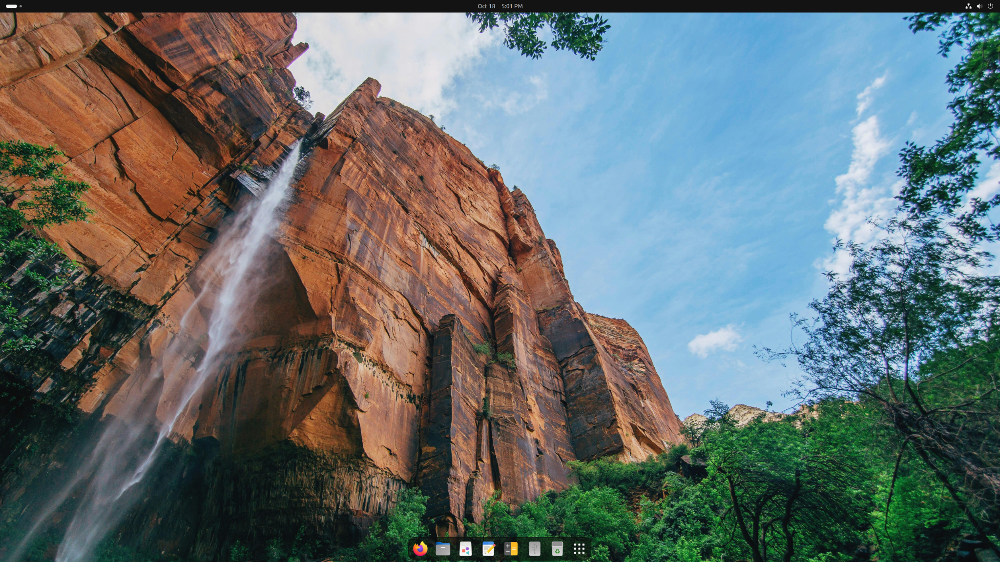
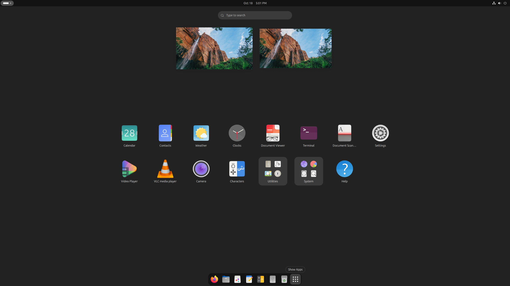

<p align="center">
  
  
  
</p>
# 🟠 Debian → Ubuntu Look Script

## Overview
This script transforms a **Debian GNOME system** into one that looks and feels like **Ubuntu 25.10** — complete with Yaru themes, Ubuntu Sans fonts, dock, icons, sound theme, and Flatpak integration.  
It’s ideal for users who prefer Debian’s stability but want Ubuntu’s modern design and polish.

## ✨ Features
- 🔸 **Builds Yaru (light)** from source into `/usr/local` (themes + icons)
- 🔸 **Installs fonts:** Ubuntu, Ubuntu Sans & Sans Mono, Liberation, Noto, DejaVu, and Microsoft Core
- 🔸 **Enables GNOME extensions:**
  - Dash-to-Dock (bottom position, Yaru-style)
  - Desktop Icons NG
  - AppIndicator Support
  - User Theme
- 🔸 **Applies Ubuntu 25.10 font and theme settings**
- 🔸 **Configures Flatpak** with Flathub integration inside GNOME Software
- 🔸 **Optionally purges** unneeded GNOME apps (LibreOffice suite, GNOME Maps, GNOME Videos, etc)
- 🔸 **Sets GRUB** to `quiet splash`
- 🔸 **Optionally configures ZRAM swap** for improved memory performance
- 🔸 **Includes feature flags** to skip steps and rerun safely

## 📸 Screenshots

### 🖼 Desktop View (After Applying Script)


### 🗂 App Grid / Activities Overview


---

## 🧰 Requirements
- Debian 12 (Bookworm) or newer (GNOME edition recommended)
- Internet connection
- `sudo` privileges

---

## 🚀 Installation & Usage

### 1. Download the script
```bash
wget https://raw.githubusercontent.com/Deihmos/Debian-Ubuntuize/main/debian-ubuntuize.sh
chmod +x debian-ubuntuize.sh
```

### 2. Run the main transformation
```bash
sudo bash debian-ubuntuize.sh apply
```

> 💡 *You can skip certain steps by setting flags before running:*
```bash
SKIP_FONTS=1 SKIP_YARU_BUILD=1 sudo bash debian-ubuntuize.sh apply
```

### 3. Refresh existing configuration after reboot or logout
```bash
sudo bash debian-ubuntuize.sh refresh
```

### 4. Remove built Yaru themes/icons
```bash
sudo bash debian-ubuntuize.sh remove-yaru
```

---

## ⚙️ Feature Flags

| Variable | Default | Description |
|-----------|----------|-------------|
| `SKIP_FONTS` | 0 | Skip font installations |
| `SKIP_YARU_BUILD` | 0 | Skip building Yaru from source |
| `SKIP_FLATPAK` | 0 | Skip Flatpak + GNOME Software setup |
| `SKIP_PURGE` | 0 | Keep stock GNOME apps |
| `ENABLE_MIN_MAX` | 1 | Show minimize/maximize buttons |
| `ENABLE_ZRAM` | 1 | Enable ZRAM swap configuration |
| `ZRAM_SIZE` | 8192 | Set zram size in MB |

---

## 🧽 Clean-Up Notes
- The script removes build dependencies automatically after Yaru install.
- If fonts are installed, `curl` and `unzip` are purged afterwards.
- All GNOME settings apply per detected GUI user.

---

## 🧩 Example: Minimal Run (no fonts, no Flatpak)
```bash
SKIP_FONTS=1 SKIP_FLATPAK=1 sudo bash debian-ubuntuize.sh apply
```

## 🧩 Example: Full Ubuntu Look + ZRAM (default)
```bash
sudo bash debian-ubuntuize.sh apply
```

---
